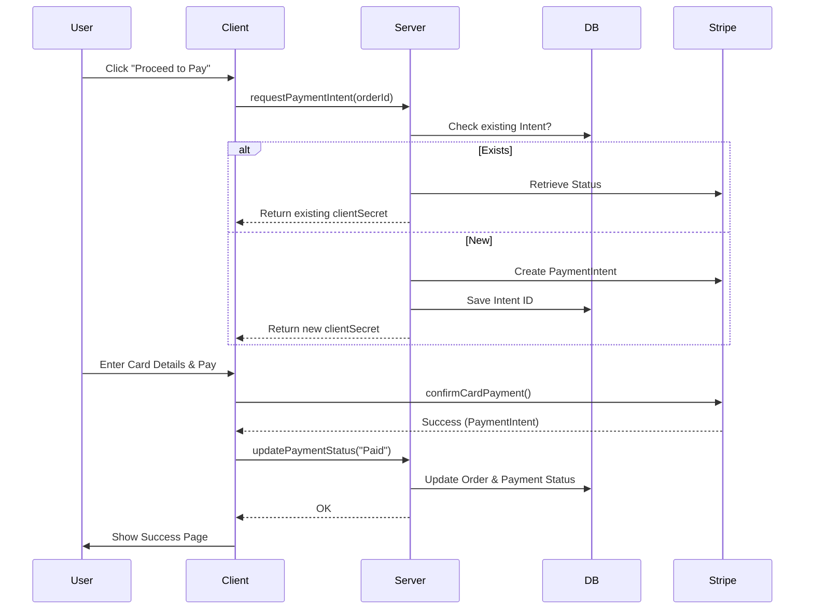

# Complex Functionality Documentation

This document outlines the most technically complex features of the ShopyOnline application: **Advanced Product Filtering** and **Stripe Payment Integration**.

---

## 1. Advanced Product Filtering / Search

### Check It Out
-   **Frontend**: `Client/src/pages/Products.jsx` (UI), `Client/src/store/slices/productSlice.js` (State)
-   **Backend**: `Server/controllers/productController.js` (`fetchAllProducts`)

### The Challenge
Implementing a flexible search and filter system that handles multiple optional parameters (Availability, Price, Category, Ratings, Search Text) simultaneously while maintaining performance and supporting pagination.

### Implementation Details
The backend uses a **Dynamic SQL Query Construction** pattern to build the `WHERE` clause based on active filters.

#### Workflow
1.  **Frontend**: Collects filters from UI and constructs a query string (e.g., `?category=electronics&price=100-500&search=macbook`).
2.  **Backend Controller**:
    -   **Params Extraction**: Parses `req.query`.
    -   **Dynamic Conditions**:
        -   Iterates through provided filters.
        -   Push SQL snippets (e.g., `price BETWEEN $1 AND $2`) into a `conditions` array.
        -   Manages bind variable indices (`$1`, `$2`...) dynamically.
    -   **SQL Assembly**: Joins `conditions` with `AND` to create the final `WHERE` clause.
    -   **Pagination**: Calculates `LIMIT` and `OFFSET` based on `page` param.
    -   **Execution**:
        -   Runs a `COUNT(*)` query first to get total items for pagination UI.
        -   Runs the main `SELECT` query with filters, sorting, and limits.

#### Key Code Snippet (Backend)
```javascript
// Dynamic AND condition builder
const whereClause = conditions.length
    ? `WHERE ${conditions.join(" AND ")}`
    : "";

// Parameterized Query execution
const result = await database.query(query, values);
```

---

## 2. Stripe Payment Integration

### Check It Out
-   **Frontend**: `Client/src/pages/Payment.jsx`, `Client/src/services/paymentService.js`
-   **Backend**: `Server/controllers/paymentController.js`, `Server/utils/generatePaymentIntent.js`

### The Challenge
Ensuring secure, idempotent payment processing that handles network failures, prevents duplicate charges, and keeps the local database in sync with Stripe's state.

### Implementation Details

#### A. Idempotency & Resiliency (`generatePaymentIntent.js`)
Instead of blindly creating a new payment intent every time the user hits the payment page, the backend:
1.  **Checks DB**: Looks for an existing `payment_intent_id` for the given `orderId`.
2.  **Verifies with Stripe**: If one exists, it fetches the latest status from Stripe.
3.  **Self-Healing**:
    -   If Stripe says "succeeded" but DB says "Pending", it automatically updates the DB to "Paid" (Handling edge cases where the client crashed after payment).
    -   If Stripe says "canceled", it deletes the local record and creates a new one.
    -   If "requires_payment_method", it reuses the existing intent to avoid duplicate checkout sessions.

#### B. Secure Frontend Flow (`Payment.jsx`)
1.  **Initialization**: Calls backend to retrieve `clientSecret` (associated with the Order).
2.  **Stripe Elements**: Uses `react-stripe-js` to render PCI-compliant input fields (CardElement).
3.  **Confirmation**: Calls `stripe.confirmCardPayment(clientSecret, ...)` directly from the browser to Stripe. **Credit card info never touches the application server**.
4.  **Completion**: On success, notifies the backend to update the order status to "Paid".

#### Data Flow Diagram

